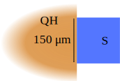
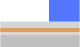

# Andreev reflection in quantum Hall systems: 2021 state of the union 
**December 9 2021**

{ width=80% }

A combination of superconductivity with quantum Hall effect allows perfectly nonlocal crossed Andreev reflection, which has made it a target of experimental search for more than a decade.

Due to progress in material physics and emergence of new hybrid platforms, this search has resulted in a series of
experiments observing a combined effect of chiral edge states and superconductivity.
At the same time, measurements of Andreev conductance in the quantum Hall regime demonstrate wildly different behaviors,
sometimes in disagreement with existing theoretical predictions.

In this workshop we aimed to bring together experts working in the field, review observations and their interpretation, and identify the possible ways forward.

## Workshop summary

Combining Andreev reflection with chiral movement of electrons is an open topic of experimental search and theoretical ideation for more than two decades. While the low magnetic field regime has been observed and offers a clear interpretation, the limit of full Landau quantization has only recently become available to experiments. There are two prominent predicted manifestations of Andreev reflection in the quantum Hall regime. 1) The supercurrent in the chiral regime acquires the Aharanov-Bohm periodicity for magnetic flux penetrating the normal region. 2) A single superconducting electrode enables injection of holes into the downstream current and, in lattice-matched graphene, generates a quantized negative nonlocal resistance. While the supercurrent signature remains unseen, nonlocal resistance measurements finding negative values (with mysteries) feature prominently in recent experimental works. For the overview see Carlo Beenakker's talk [below](#the-search-for-chiral-andreev-edge-states).

The three experiments of the workshop used different material platforms and geometries summarized in the table below. The experiment presented by Gleb Finkelstein observed chaotic conductance oscillations that rapidly decay with the loss of phase coherence. This result and the authors' interpretation agree with recent [numerical simulations](#mechanisms-of-andreev-reflection-in-quantum-hall-graphene) and the [analytical theory](#mesoscopic-conductance-along-the-proximitized-quantum-hall-edge) presented in the satellite talks. This data also exhibits jumps with magnetic field, consistent with the [analysis](#mesoscopic-conductance-along-the-proximitized-quantum-hall-edge) of the effect of vortex entrance. The other two experiments demonstrate a systematically negative downstream resistance with no apparent mesoscopic fluctuations. The results reported by Onder Gul extend to the fractional quantum Hall regime, that was analysed by the authors using the renormalization group approach as well as in one of the [satellite talks](#induced-superconductivity-in-fqh-edges-in-presence-of-dissipation). The reasons for the difference in the observations are as yet unknown. In addition to these works, the [experiment](#longitudinal-resistance-oscillations-in-insbas-2degs-in-a-quantum-hall-regime) reported by Ivan Kulesh, observed fluctuations in the downstream resitance interpreted as tunneling through the quantum Hall bulk—a phenomenon that may complicate the analysis of Andreev reflection in small samples (relevant to the experiments presented by Onder and Gleb).

| [Speaker](talk link), Reference | Onder Gul, [arXiv:2009.07836](https://arxiv.org/abs/2009.07836), [arXiv:1609.08104](https://arxiv.org/abs/1609.08104)  | Gleb Finkelstein, [arXiv:1907.01722](https://arxiv.org/abs/1907.01722)   | Javad Shabani, [arXiv:2108.08899](https://arxiv.org/abs/2108.08899)  | 
| - | - | - | - | 
|**Top-down**   |  |   |   | 
| **Cross-section**  |  |  |  |
| **Materials**   |Graphene, NbTiN | Graphene, MoRe | InAs 2DEG, NbTiN |
| **Main observations**   ($R$ is nonlocal voltage divided by drain current)| $R \approx \textrm{const}< 0$ for integer and fractional QHE; $R \to 0$ at $W \gtrsim 0.2\mu\textrm{m}$ | Oscillatory $R$, $\langle G \rangle = 0$; $\textrm{var}(R) \to 0$ with $T\gtrsim 0.2K$; sudden jumps in $R(B)$ | $R \approx \textrm{const} < 0$ in integer QHE plateaus; $R <0$ persists to $I \gtrsim 5\mu\textrm{A}$ | 

Between the seminars and the discussion session, a number of open questions, needed experiments, and needed theory, were identified.

### Open questions

1. What is the nature of the persistent negative nonlocal resistances in the measurements presented by Onder and Javad?
2. Is it possible to experimentally observe the influence of valley physics in the graphene versions of these systems?
3. Are the differences in contact types (edge contact for graphene, planar proximitization for InAs) important? Relatedly, what about the difference between a soft and hard edge potential in the NS contact region?
4. Can the negative influence of the superconducting vortices be eliminated in the experiment?
5. Can the systematic difference between Andreev and normal reflections be explained by the breaking of particle-hole symmetry by the finite bias?

### Ideas for further experiments

1. Noise measurement to reveal the charge of the Andreev reflected holes.
2. Tunneling into the possible zero mode at the end of the finger in the geometry presented by Onder. 
3. Quantum point contact at QH-superconductor interface. 
4. Chicken-wire patterns for superconducting films to minimize the presence of vortex normal cores.
5. Chern insulator normal regions for low-external-field versions of these experiments. 
6. Type-II superconductors with high Hc1 so that QH develops before vortices.

## Workshop videos

#### The search for chiral Andreev edge states
**By [Carlo Beenakker](https://www.lorentz.leidenuniv.nl/beenakker/), Leiden University**  

<iframe width="700" height="400" src="https://www.youtube-nocookie.com/embed/xPlPz1a5Zq8" frameborder="0" allow="accelerometer; autoplay; encrypted-media; gyroscope; picture-in-picture" allowfullscreen></iframe>

??? summary "Video minutes"
  
    - [time=0:01:31] Skipping-orbits for both electrons and holes are in the same direction (opposite sign of both charge and mass). Expt. [10.1103/PhysRevB.76.115313](https://journals.aps.org/prb/abstract/10.1103/PhysRevB.76.115313)  
    
    - [time=0:04:52] Chiral modes don't necessarily transport a unit of charge. The transferred charge can even be zero.
    
    - [time=0:05:31] The early works in the field are in "skipping orbit" limit. It is important to reach the single Landau level regime.
    
    - [time=0:07:19] In graphene, Andreev reflection switches the valleys. Furthermore, the lowest Landau level in graphene is valley polarized. Therefore, there is no electron-hole conversion when the superconductor covers a single edge.
    
    - [time=0:07:19] Valley polarization sets a selection rule for Andreev processes in graphene.
    
    - [time=0:07:19] A two-terminal setup is considered in the theoretical work, while a three-terminal setup in the experiment. For a clean interface, quantized conductance is expected [[arXiv:cond-mat/0612698](https://arxiv.org/abs/cond-mat/0612698)]. In the experiment, conductance is not quantized and has irregular fluctuations [[arXiv:1907.01722](https://arxiv.org/abs/1907.01722)].
    
    - [time=0:10:08] Interface disorder plays a major role [[arXiv:2103.06722](https://arxiv.org/abs/2103.06722)]. Not as universal as one would desire.
    
    - [time=0:12:10] Chiral Andreev edge modes can carry supercurrent in a two-terminal Josephson junction setup.
    
    - [time=0:13:53] For a squid ring, $4\pi$-periodicity in flux difference ($\delta \phi$) in the critical current is expected (so-called $4\pi$ periodic Fraunhofer oscillations). But, in the experiment by [Amet et al. Science  352, 966 (2016)](https://www.science.org/doi/abs/10.1126/science.aad6203), period-doubling is not observed.
    
    **Questions period**
    
    - [time=0:16:53] Q (Yoichi Ando): In these experiments, how do we consider spins? 
        A: For odd filling factor, spin-orbit coupling is critical for Andreev reflection processes (for odd filling factor). The reason is that spin-polarized edge states are not supposed to feature Andreev reflection.
    
    - [time=0:18:16] Q (Leonid Glazman): Remarks that there were earlier experimental works than the one presented by Carlo.
    
    - [time=0:19:13] Q: Referring to slide 3 of Carlo's talk: in the bottom left picture, it really depends on the deatils of the lattice because the boundary. Could one deform the top in the bottom picture? Is there any intermediate point? See Figure 1 from [arXiv:cond-mat/0612698](https://arxiv.org/abs/cond-mat/0612698) 
        A: In general, any graphene edge behaves as zigzag in long lengthscales ([arXiv:0710.2723](https://arxiv.org/abs/0710.2723)), which means that valley is a good quantum number. Thus, isospins in different edges can only be paralell or anti-parallel. What really matters is that if you cover a single edge or two edges.
      

#### Crossed Andreev reflection in fractional quantum Hall graphene devices
**By [Önder Gül](https://kim.physics.harvard.edu/people/onder-gul), Harvard University**  

Based on [arXiv:2009.07836](https://arxiv.org/abs/2009.07836) and [arXiv:1609.08104](https://arxiv.org/abs/1609.08104)   

<iframe width="700" height="400" src="https://www.youtube-nocookie.com/embed/9q16y_W30UU" frameborder="0" allow="accelerometer; autoplay; encrypted-media; gyroscope; picture-in-picture" allowfullscreen></iframe>

Video minutes

 
test

**Questions and answers**

There were no questions due to time limitations.

#### Supercurrent and Andreev edge states in the quantum Hall regime
**By [Gleb Finkelstein](http://webhome.phy.duke.edu/~gleb/), Duke University**  

Based on [arXiv:1901.05928](https://arxiv.org/abs/1901.05928) and [arXiv:1907.01722](https://arxiv.org/abs/1907.01722)   

<iframe width="700" height="400" src="https://www.youtube-nocookie.com/embed/Hy8JMaslZLw" frameborder="0" allow="accelerometer; autoplay; encrypted-media; gyroscope; picture-in-picture" allowfullscreen></iframe>

#### Integer quantum Hall effect with a superconducting contact
**By [Javad Shabani](https://wp.nyu.edu/shabanilab/), New York University**  

Based on [arXiv:2108.08899](https://arxiv.org/abs/2108.08899) and ongoing work

<iframe width="700" height="400" src="https://www.youtube-nocookie.com/embed/f6KXtKp8mJo" frameborder="0" allow="accelerometer; autoplay; encrypted-media; gyroscope; picture-in-picture" allowfullscreen></iframe>

####  Panel discussion with speakers and the participants

<iframe width="700" height="400" src="https://www.youtube-nocookie.com/embed/VTIyOI3d5Ms" frameborder="0" allow="accelerometer; autoplay; encrypted-media; gyroscope; picture-in-picture" allowfullscreen></iframe>

## Satellite talks




### {{ talk1.title }}
**By {{ talk1.speaker_name }} ({{ talk1.speaker_affiliation }})**

===! "Video recording"

    <iframe width="700" height="400" src="https://www.youtube-nocookie.com/embed/{{ talk1.youtube_id }}" frameborder="0" allow="accelerometer; autoplay; encrypted-media; gyroscope; picture-in-picture" allowfullscreen></iframe>

=== "Details"

    **Authors:** {{ talk1.authors }}  
    **Preprint:** [arXiv:{{ talk1.preprint }}](https://arxiv.org/abs/{{ talk1.preprint }})

    {{ talk2.abstract | indent(width=4) }}

### {{ talk2.title }}
**By {{ talk2.speaker_name }} ({{ talk2.speaker_affiliation }})**

===! "Video recording"

    <iframe width="700" height="400" src="https://www.youtube-nocookie.com/embed/{{ talk2.youtube_id }}" frameborder="0" allow="accelerometer; autoplay; encrypted-media; gyroscope; picture-in-picture" allowfullscreen></iframe>

=== "Details"

    **Authors:** {{ talk2.authors }}  
    **Preprint:** [arXiv:{{ talk2.preprint }}](https://arxiv.org/abs/{{ talk2.preprint }})

    {{ talk2.abstract | indent(width=4) }}

### Mesoscopic conductance along the proximitized quantum Hall edge
** by Vladislav D. Kurilovich (Department of Physics, Yale University)**

===! "Video recording"

    <iframe width="700" height="400" src="https://www.youtube-nocookie.com/embed/y0RkSdphwh4" frameborder="0" allow="accelerometer; autoplay; encrypted-media; gyroscope; picture-in-picture" allowfullscreen></iframe>

=== "Details"

    **Authors:** Vladislav D. Kurilovich, Leonid Glazman  
    **Preprint:** [arXiv:2201.00273](https://arxiv.org/abs/2201.00273)

### Induced Superconductivity in FQH Edges in Presence of Dissipation
** by Noam Schiller (Weizmann Institute) and Barak A. Katzir (Technion)**

===! "Video recording"

    <iframe width="700" height="400" src="https://www.youtube-nocookie.com/embed/h0rS7TyUUMI" frameborder="0" allow="accelerometer; autoplay; encrypted-media; gyroscope; picture-in-picture" allowfullscreen></iframe>

=== "Details"

    **Authors:** Noam Schiller, Barak A. Katzir, Ady Stern, Erez Berg, Netanel Lindner, Yuval Oreg

## Organizers

[Anton Akhmerov](https://antonakhmerov.org/), TU Delft  
[Valla Fatemi](https://fatemilab.aep.cornell.edu/), Yale University & Cornell University  
[Christian Schoenenberger](https://nanoelectronics.unibas.ch/), University of Basel

If you have any questions, you may reach us via arqh2021@virtualscienceforum.org

### Additional Credits

We would like to thank Isidora Araya, Mert Bozkurt,  Cunxiao Liu, Antonio Manesco, and Juan Torres for their contriubtions of compiling the questions and answers as well as compiling the meeting minutes. 
